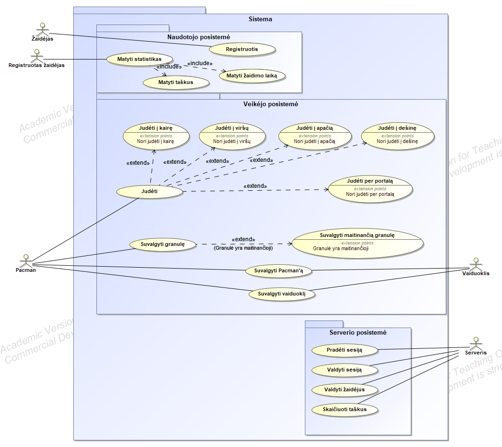
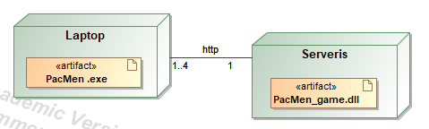

# "Pac-Men" žaidimas

## Žaidimo aprašymas

Kuriama klasikinio žaidimo „Pac-Man“ interpretacija. Standartiškai žaidime dalyvauja žaidėjas ir trys
kompiuterio valdomi priešai, vadinami vaiduokliais, o kuriamame projekte dalyvauja 4 žaidėjai ir 4
vaiduokliai. Žaidėjo tikslas surinkti visas žemėlapyje išdėstytas granules ir nebūti
suvalgytam vaiduoklio. 

## Pasileidimo instrukcijos

Žaidimas sudarytas iš frontend dalies ir serverio. Žaidimą galima žaisti vienam arba keliese.

Paleidimas vienam žmogui:

* Iš "releases" skilties parsisiųsti "Client.zip" bei "Server.zip".
* Abu archyvus išarchyvuoti norimoje vietoje savo kopiuteryje.
* Paleisti "Server.zip" archyve esantį "Server.exe" failą. Tai įjungs žaidimo serverį.
* Paleisti "Client.zip" archyve esantį "PacMen.exe" failą. Tai įjungs patį žaidimą.
* Žaidime įvesti savo vardą kairėje esančiame lange ir paspausti mygtuką "Connect to Local server". Žaidimas pasileis ir galėsite žaisti.

Paleidimas keliems žmonėms:

* Parsisiųti kodą.
* Atidarti `Server/appsettings.json` failą ir jame pakeisti "Port" į norimą arba palikti 7255.
* Subuildinti kodą ir paleisti jį norimame, pasiekiamame kompiuteryje ar debesyje.
* Sužinoti kompiuterio, kuriame yra serveris, viešą IP adresą.
* Parsisiųsti "Client.zip" iš "releases" skilties ir įkelti į kompiuterius, kurie gali pasiekti serverį.
* Paleisti "PacMen.exe" failą.
* Žaidime įvesti savo vardą bei serverio adresą, o po to paspausti mygtuką "Connect to server". Žaidimas pasileis ir galėsite žaisti.

## Panaudojimo atvejų diagrama.

## Projekto diegimas

Žemiau pateikiama žaidimo diegimo diagrama.

## Projekto autoriai

Paulius Želvys, Benas Lukošius, Paulius Preikša, Karolina Belousova.

